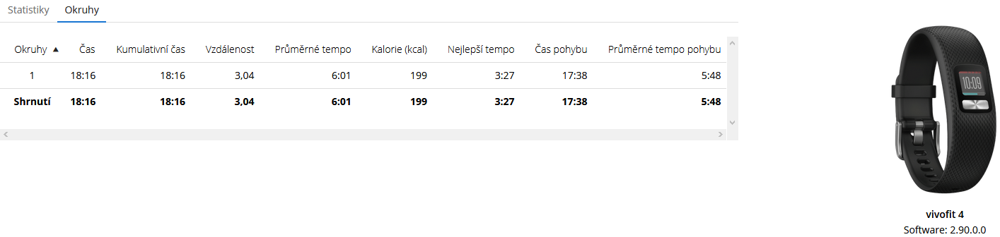
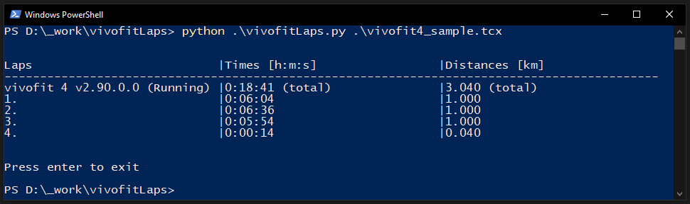

# vivofitLaps
python tool for generating laps per approx 1 km from \*.tcx file from Garmin Connect.

## Prerequisites
python3

## Demo
### Usage
```
PS D:\_work\vivofitLaps> python .\vivofitLaps.py .\vivofit4_sample.tcx
```
### Garmin Connect - all in one lap

### vivofitLaps - per laps 

